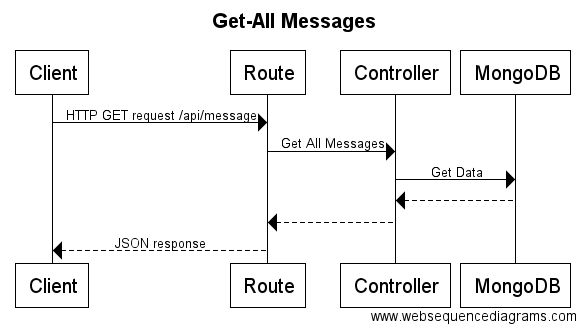
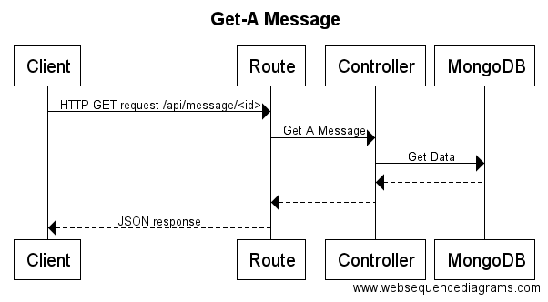
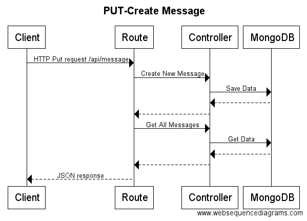
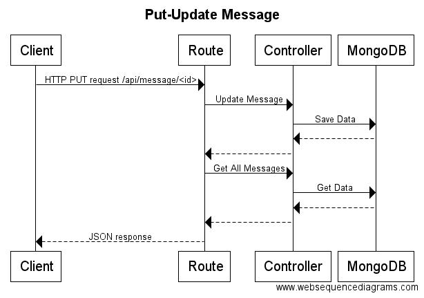
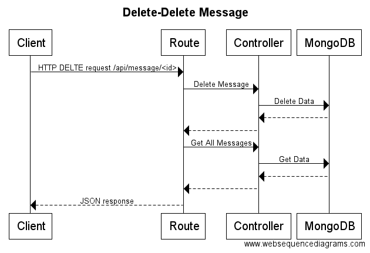

# Palindrome
Palindrome is a MEAN stack application that can determine if a message is a palindrome or not. It has an Angular front end which interfaces with a RESTful API to create, read, update and delete messages.  

##Live demo
A live demo of this application can be found [here](http://palindrome.dustless.club/).

##Instructions
Download the source code
```
git clone https://github.com/joshhsoj1902/palindrome.git .
```
###Development environment
####1. Install npm packages
```
npm install
```
####2. MongoDB
By default in the development environment the application looks for a database at:
```
mongodb://localhost/palindrome-dev
```
This can be overridden by setting the MONGO_URL environment variable before launching the application.
####3. Launch the application
```
node app.js
```
####4. Accessing the application
The application will now be running at:
```
http://localhost:3000
```

###Docker
If you only wish to run this application and have no intention on making source changes, it's much easier to use the [Palindrome docker recipe](https://github.com/joshhsoj1902/Palindrome-docker-recipe).
####Prerequisites
Docker must be installed and MongoDB needs to be running somewhere.
####1. Build the image
```
docker build -t joshhsoj1902/palindrome .
```
####2. Run the newly built image
To run the application update this command to point at your MongoDB and then run it:
```
docker run -d --name palindrome_app -p 3000:3000 -e "MONGO_URL='mongodb://<MongoDB's IP:Port>/palindrome'" -it joshhsoj1902/palindrome
```
####3. Accessing the application
The application will now be running at:
```
http://localhost:3000
```

##Application details
### API documentation
Details on the API can be found on the live demo [here](http://palindrome.dustless.club/apidoc) or on a local instance of the app at
```
localhost:3000/apidoc
```
The local copy can be regenerated using 
```
npm run apidoc
```
###Testing
The test suite can be ran using the command:
```
npm run test
```
###Sequence Diagrams
#### GET Messages

#### GET Message

#### PUT (Create) Message

#### PUT (Update) Message

#### DELETE Message

